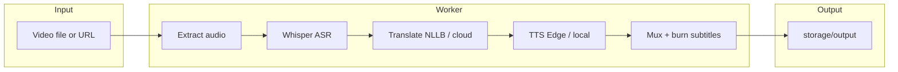
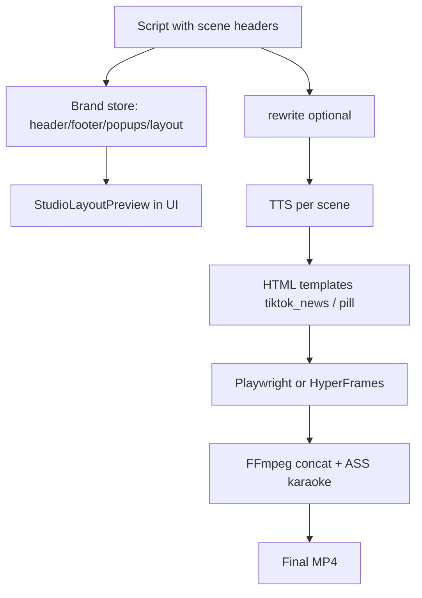
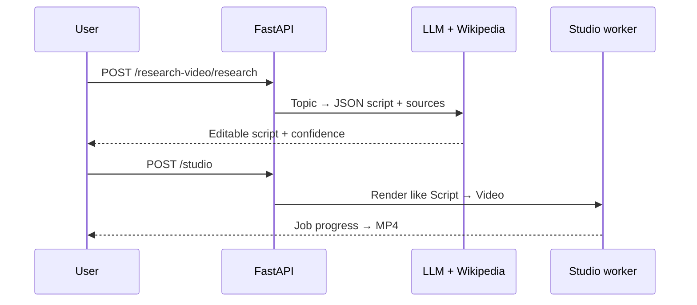
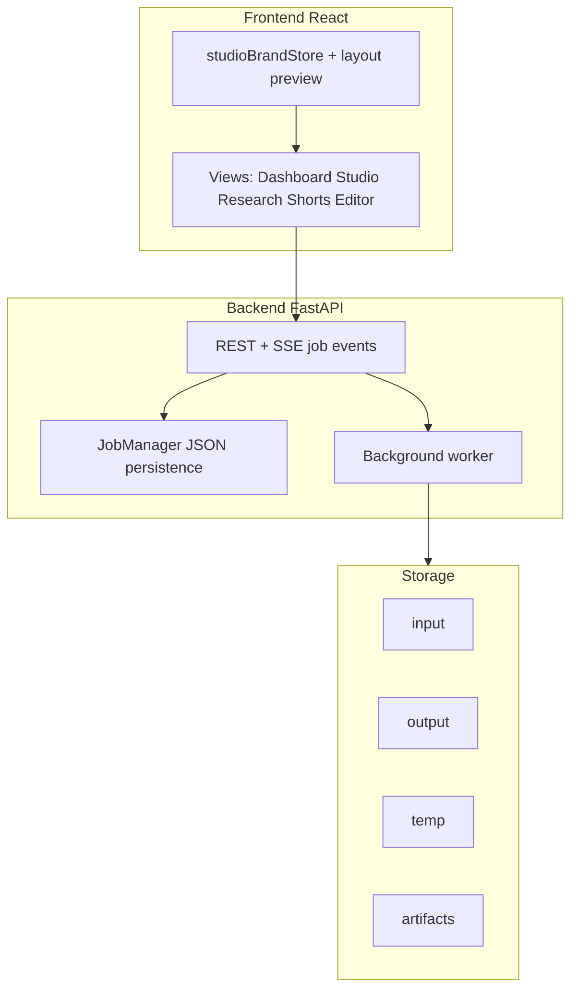

# Dubify — AI Video Localization & Studio

Dubify dubs long-form video, turns scripts into narrated short-form videos (TikTok/Reels style), and can auto-cut dubbed shorts. Built with **FastAPI**, **React**, **FFmpeg**, **faster-whisper**, and optional **Playwright / HyperFrames** for HTML scene rendering.

## Quick start

**Windows (one command):**

- CMD: `run_dev.bat`
- PowerShell: `./run_dev.ps1`

**Manual:**

```bash
# Backend
cd backend && pip install -r requirements.txt
uvicorn app.main:app --reload

# Frontend
cd frontend && pnpm install && pnpm dev
```

- UI: http://localhost:5173  
- API: http://localhost:8000  

**Docker:** `docker compose up --build -d`

---

## How it works

### Product flows

| Flow | Input | Pipeline | Output |
|------|--------|----------|--------|
| **Dub Video** | File or URL | ASR → translate → TTS → mux | Dubbed MP4 + subtitles |
| **Script → Video** | Script + brand layout | Scene split → TTS → HTML render → burn subs | Vertical/landscape MP4 |
| **AI Research Video** (Beta) | Topic | LLM research brief → script → same as Studio | Explainer MP4 |
| **Auto Shorts** | Long video | Full dub → segment → 9:16 clips | Part 1, 2, … |
| **Studio Editor** | Completed job | Cue edit → optional re-burn | Updated SRT/MP4 |

### Dubbing pipeline (Dashboard)



### Script → Video (Studio)



Scene markers use lines like `[Hook]` / `[Phần chính]`. Popups use `[STAT: …]` and `[DEF: …]` in the script.

### AI Research Video (Beta)



See [docs/AI_RESEARCH_VIDEO_BETA.md](docs/AI_RESEARCH_VIDEO_BETA.md) for roadmap (stock images, PDF upload, etc.).

### Processing profiles (Settings)

- **Hybrid** — local ASR/translation, online TTS when allowed  
- **Fully local** — offline-only stack  
- **Cloud** — cloud LLM/translation when API keys are set  

---

## Architecture



**Key backend modules**

- `VideoService` — FFmpeg, mux, clips, 9:16 crop  
- `ASRService` — faster-whisper  
- `TranslateService` — NLLB / cloud  
- `TTSService` — Edge-TTS (async API) + local fallbacks  
- `studio_html_service` / `hyperframes_render` — scene HTML → video  
- `research_video_service` — Beta topic → script  

---

## Studio setup notes

```bash
pip install -r backend/requirements.txt
python -m playwright install chromium   # HTML scene render
# Optional: Node 22+ for HyperFrames — see docs/HYPERFRAMES.md
```

Optional BGM: drop `.mp3` files in `storage/bgm/`.

**Script example:**

```text
[Hook]
Tin nóng hôm nay.
[STAT: 47% — tăng trưởng YoY]

[Insight]
[DEF: Gemini — AI điều khiển thao tác trên điện thoại]
Theo dõi kênh để cập nhật thêm.
```

---

## Docs & credits

| Doc | Topic |
|-----|--------|
| [docs/HYPERFRAMES.md](docs/HYPERFRAMES.md) | HyperFrames render path |
| [docs/INSPIRED_REPOS.md](docs/INSPIRED_REPOS.md) | Borrowed patterns |
| [docs/AI_RESEARCH_VIDEO_BETA.md](docs/AI_RESEARCH_VIDEO_BETA.md) | Research Video beta |

Inspired by HyperFrames, Pixelle-Video, OpenReel, faster-whisper, edge-tts, FFmpeg, and others — see INSPIRED_REPOS.

---

## Maintainer

**Trinh Hoang Tu (thtcsec)** — © 2026 Dubify AI

### Douyin / TikTok cookies

If downloads fail with cookie errors, set in `.env`:

```bash
YTDLP_COOKIES_FROM_BROWSERS=chrome,edge,firefox
YTDLP_COOKIE_FILE=
YTDLP_PROXY=
DOUYIN_FALLBACK_API_BASE=
```
